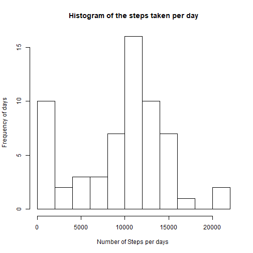
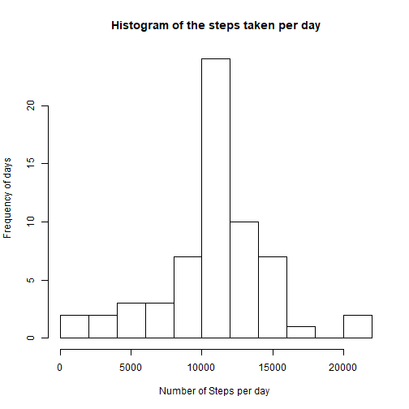

### Loading and preprocessing the data 

**1. Load the data**  

* import the file in a temporary file  
* unzip the file and read it into the R environment  


```r
temp <- tempfile()
download.file("https://d396qusza40orc.cloudfront.net/repdata%2Fdata%2Factivity.zip",temp)
activity <- read.csv(unzip(temp, "activity.csv"))
unlink(temp)

library(dplyr)
```

```
## 
## Attaching package: 'dplyr'
```

```
## The following objects are masked from 'package:stats':
## 
##     filter, lag
```

```
## The following objects are masked from 'package:base':
## 
##     intersect, setdiff, setequal, union
```

```r
library(lattice)
```
 \  
 
  
**2. Process the data**   

* Convert the date column to date format  
    
    

```r
activity$date <- as.Date(activity$date, "%Y-%m-%d")
```
  
\  
\  
\  


### What is mean total number of steps taken per day?

**1. Make a histogram of the total number of steps taken each day**  
  
  
The first step is to create a new table containing:    
  
* Aggregate the number of steps per day   
* NA values will be excluded in this step  


```r
activity.ex.na.daily <- aggregate(activity[, 1], by = list(activity$date), FUN = sum, na.rm = TRUE)
```
\  

The next step is to create the histogram. The graph shows the number of days that a certain amount of steps have been taken 


```r
hist(activity.ex.na.daily$x, 
     ylab = "Frequency of days", 
     xlab = "Number of Steps per days ", 
     main = "Histogram of the steps taken per day", 
     breaks = 10
     )
```


\  
\  

**2. Calculate and report the mean and median total number of steps taken per day**  


```r
mean.steps.daily <- mean(activity.ex.na.daily$x)
median.steps.daily <- median(activity.ex.na.daily$x)
```

The mean steps taken by day is **9354.23** and the median is **10395**  
\  
\  
\  
  
    
     
### What is the average daily activity pattern?  
  

**1. Make a time series plot (i.e. type = "l") of the 5-minute interval (x-axis) and the average number of steps taken, averaged across all days (y-axis)**  
\  

* The first step is to average the activity by interval, for all days  
* Remove NA in the process  


```r
activity.ex.na.interval <- aggregate(activity$steps, by = list(activity$interval), na.rm = TRUE,FUN = mean)
```
  
  
* The next step is to create the linechart   


```r
plot(activity.ex.na.interval$Group.1, activity.ex.na.interval$x, 
      type = "l",
     ylab = "Average number of steps",
     xlab = "Interval", 
     main = "Average activity during the day")
```


  
  
**2. Which 5-minute interval, on average across all the days in the dataset, contains the maximum number of steps?**  


```r
activity.ex.na.interval[activity.ex.na.interval$x == max(activity.ex.na.interval$x), "Group.1"]
```

```
## [1] 835
```
  
    
      
### Imputing missing values   
\  
  
**1. Calculate and report the total number of missing values in the dataset (i.e. the total number of rows with NAs)**   

The code performs two activities:  
1. Subset the number of incomplete cases (including NA) in the dataset  
2. Count the number of rows of the dataset only including incomplete cases

```r
nrow(activity[!complete.cases(activity), ])
```

```
## [1] 2304
```
\    
\    
**2. Devise a strategy for filling in all of the missing values in the dataset. The strategy does not need to be sophisticated. For example, you could use the mean/median for that day, or the mean for that 5-minute interval, etc.**   

The strategy to fill the NA's is to use the **mean by interval**. For this, the dplyr package is used. If the steps are NA, then the data is filled in using the median of steps of the respective interval  

\     
\   
**3. Create a new dataset that is equal to the original dataset but with the missing data filled in** 


```r
activity.na.mean <- activity %>% 
                    group_by(interval) %>% 
                    mutate(steps = ifelse(is.na(steps), 
                                            mean(steps, na.rm = TRUE), 
                                            steps
                                          )
                           )
```
\  
\  
**4. Make a histogram of the total number of steps taken each day and Calculate and report the mean and median total number of steps taken per day. Do these values differ from the estimates from the first part of the assignment? What is the impact of imputing missing data on the estimates of the total daily number of steps?** 


```r
activity.na.mean.daily <- aggregate(activity.na.mean$steps, by = list(activity.na.mean$date), FUN = sum)

hist(activity.na.mean.daily$x, 
     ylab = "Frequency of days", 
     xlab = "Number of Steps per day ", 
     main = "Histogram of the steps taken per day", 
     breaks = 10
     )
```



```r
na.mean.steps.daily <- mean(activity.na.mean.daily$x)
na.median.steps.daily <- median(activity.na.mean.daily$x)
```
 
The results can be found below. The columns depict the method how the NA is treated, the rows show the mean and median for the respective method 


|       |Remove NA                      |Impute NA by mean|  
|-------|:-----------------------------:|:---------------:|   
|Mean   |9354.23 |10766.19|
|Median |10395         |10766.19|

\  
\  
\  

### Are there differences in activity patterns between weekdays and weekends?   

**1. Create a new factor variable in the dataset with two levels -- "weekday" and "weekend" indicating whether a given date is a weekday or weekend day.**  


```r
activity.na.mean$weekday <- ifelse(weekdays(activity.na.mean$date) %in% c("zaterdag", "zondag"), "weekend", "weekday")
activity.na.mean$weekday <- as.factor(activity.na.mean$weekday)
```

* Get the mean by interval, sorted by both weekdays and weekends  


```r
activity.mean.interval.week <- aggregate(activity.na.mean$steps, 
                                         by = list(activity.na.mean$weekday, activity.na.mean$interval), 
                                         FUN = mean)
```
\   
\   
**2. Make a panel plot containing a time series plot (i.e. type = "l") of the 5-minute interval (x-axis) and the average number of steps taken, averaged across all weekday days or weekend days (y-axis). The plot should look something like the following, which was created using simulated data**  


```r
xyplot( x ~ Group.2 | Group.1, data = activity.mean.interval.week, 
        type = "l", 
        layout = c(1,2), 
        xlab = "Mean number of steps",
        ylab = "Interval")
```


